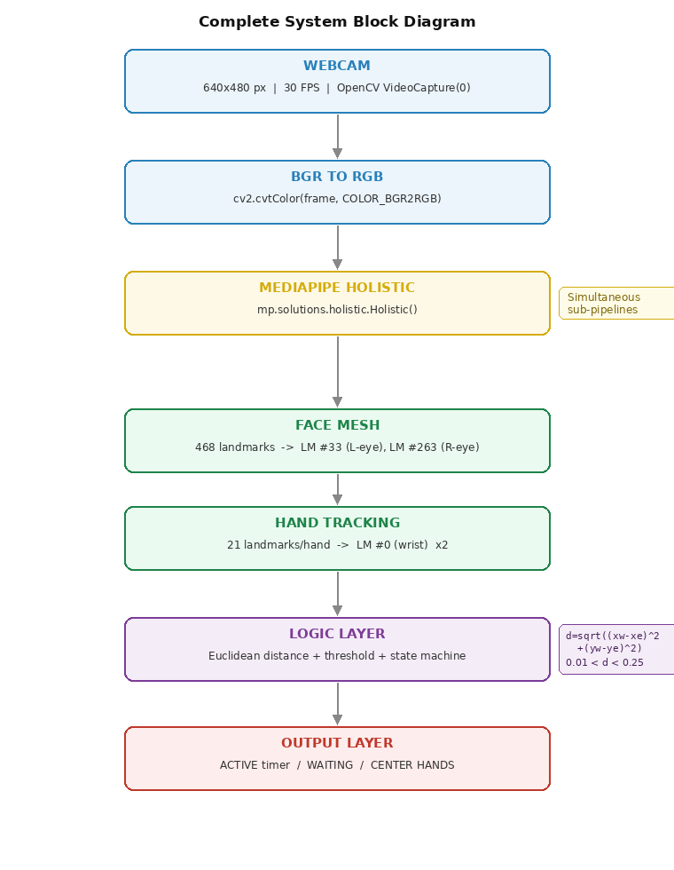

# 👁️ Automated Verification of Athlete Palming Exercises

> A privacy-first Computer Vision system to verify ocular recovery exercises using MediaPipe Holistic and a custom Spatial-Memory State Machine.

  

## 📌 Overview
**Palming** is a therapeutic technique where athletes cup their palms over closed eyes to activate the Parasympathetic Nervous System (PNS) and improve reaction time. However, since athletes perform this at home, coaches have no way to verify compliance.

This project is a **Web-Based Compliance Monitor** that uses a standard webcam to:
1.  **Detect** if the athlete is performing the "Palming" posture correctly.
2.  **Handle Occlusion** (the hands covering the face) without losing tracking.
3.  **Record** the session duration automatically.

## 💡 Key Innovation: The "Spatial-Memory State Machine"
The core technical challenge in this project is **Self-Occlusion**. Standard Face Mesh models fail when hands cover the face. 

We solved this by implementing a **Spatial-Memory State Machine**:
* **IDLE:** Tracks eye coordinates normally.
* **FACE LOCKED:** As hands approach the face ($d < 0.25$), the system **freezes** the last known eye coordinates in memory.
* **PALMING ACTIVE:** The system calculates the distance between the *live* wrist position and the *frozen* eye coordinates to verify the posture even when the face is hidden.


*(Place your screenshot of Fig 5 from the documentation here)*

## ⚙️ System Architecture
The application runs entirely on the CPU (approx. 30 FPS) using a geometric approach rather than deep learning classification, ensuring low latency and privacy.

1.  **Input:** 640x480 Webcam Feed.
2.  **Perception:** MediaPipe Holistic extracts Eye (#33, #263) and Wrist (#0) landmarks.
3.  **Logic:** Euclidean Distance calculation with hysteresis thresholds.
4.  **Privacy:** Video is processed in RAM only. **No video data is ever saved to disk.**


*(Place your screenshot of the System Block Diagram here)*

## 🚀 Installation & Setup

**Prerequisites:** Python 3.10 or 3.11 is required (MediaPipe does not yet support Python 3.13).

```bash
# 1. Clone the repository
git clone [https://github.com/jayz97/athlete-palming.git](https://github.com/jayz97/athlete-palming.git)
cd athlete-palming

# 2. Create a Virtual Environment (Recommended)
py -3.11 -m venv venv
.\venv\Scripts\activate

# 3. Install Dependencies
pip install -r requirements.txt